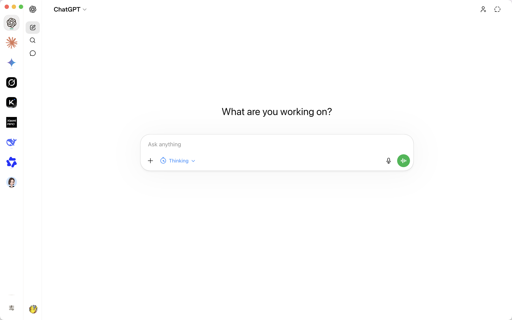
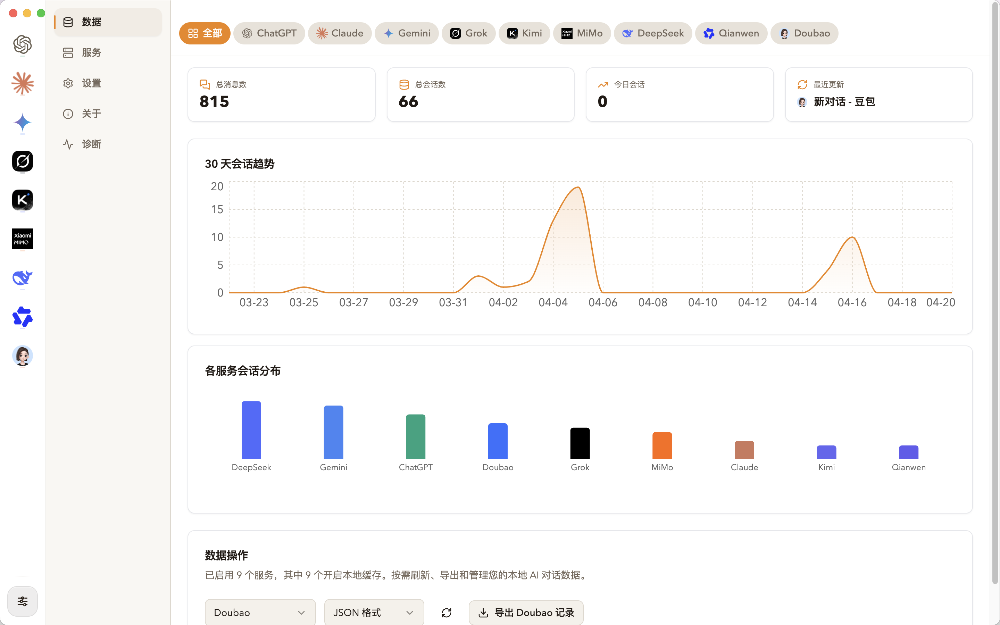

<h1 align="center">AmberKeeper</h1>

<p align="center">
  <strong>让 AI 的灵光，凝成琥珀</strong>
</p>

<p align="center">
  本地优先的多 AI 对话留存与管理桌面工作台。
  <br />
  继续使用官方网页聊天，同时把每一次问答自动沉淀为属于你自己的本地资产。
</p>

<p align="center">
  <a href="https://www.electronjs.org/">
    
  </a>
  <a href="https://react.dev/">
    
  </a>
  <a href="https://www.typescriptlang.org/">
    
  </a>
  
  <a href="./LICENSE">
    
  </a>
</p>

<p align="center">
  AmberKeeper 聚焦于多 provider 对话采集、缓存、重启持久化与本地工作台管理。
</p>

> 如果 Mac 安装打开后提示 `“AmberKeeper”已损坏，无法打开。`，执行下 `xattr -rd com.apple.quarantine /Applications/AmberKeeper.app` 这个命令。

## 界面预览

<p align="center">
  
</p>

<p align="center">
  
</p>

## 为什么是 AmberKeeper

AI 对话常常是灵感、推演、研究与决策的第一现场，但它们通常散落在不同 provider 的网页里，难以回看、检索、迁移，也很难真正成为长期资产。

AmberKeeper 不试图取代官方聊天界面，而是做一件更克制也更重要的事: 在不改变你原有使用习惯的前提下，把这些转瞬即逝的对话稳定留在本地，持续沉淀、可回看、可管理。

## 核心能力

- **官方网页原样使用**: 继续使用你自己的账号、自己的订阅和官方能力，ChatGPT Plus 还是 Plus，Claude Pro 还是 Pro。
- **不走 API，不额外计费**: AmberKeeper 不是 API 代理，而是一个带本地记忆能力的桌面工作台。
- **自动采集并本地归档**: 在你聊天的同时，应用会把对话抓取、整理并落到本地。
- **多 provider 统一管理**: 在一个桌面窗口中切换多个 AI 服务，保留各自登录态与上下文。
- **为后续检索和知识沉淀准备数据**: 归档下来的不只是聊天记录，更是未来统计、总结、标签化和知识库构建的原始材料。

## 名字的由来

**Amber** 是琥珀，意味着把某个瞬间完整封存下来。**Keeper** 是留存与守护的人。

AmberKeeper 想做的，就是把你和 AI 之间那些本来会流走的灵光、推演与表达，凝成可以长久保留、随时回看的琥珀。

## 当前支持的 AI Provider

AmberKeeper 当前内置支持:

- ChatGPT
- Claude
- Gemini
- DeepSeek
- Grok
- Kimi
- 通义千问
- 豆包
- 小米 AI Studio

这些会话可以在应用内统一管理与归档。

如果你还有其他常用 AI 站点，也可以把它作为自定义服务添加进来。自定义服务当前主要用于统一入口，不参与内置 provider 级的自动采集。

## 设计原则

- **本地优先**: 对话数据默认沉淀在你自己的设备上，而不是上传到额外后端。
- **官方环境优先**: 使用 Electron 原生 `WebContentsView` 承载 provider 官方网页，尽量保持原站体验。
- **克制而可扩展**: 不做“更花哨的聊天 UI”，重点放在采集、缓存、持久化和工作台管理。
- **Provider 拆分架构**: 每个 provider 独立适配，方便后续持续扩展与维护。

## 当前进展

当前版本已经可以:

- 同时管理多个 AI 站点的登录状态
- 自动抓取并持久化对话数据
- 在本地工作台中浏览、筛选与回看归档内容

后续会继续打磨检索、标签、摘要、统计与可视化能力，让这些历史对话真正开始为你工作。

## 快速开始

### 环境要求

- Node.js
- pnpm

### 开发

```bash
pnpm install
pnpm desktop:dev
```

### 测试

```bash
pnpm desktop:test
```

### 构建桌面应用

```bash
pnpm desktop:build
pnpm desktop:dist
```

## 项目结构

```text
.
├── apps/desktop               # Electron 桌面应用
├── packages/capture-core      # 采集运行时与通用能力
├── packages/provider-*        # 各 AI provider 适配层
├── packages/shared-types      # 共享类型定义
└── docs/                      # 架构、计划与研究文档
```

## 关键文档

- [AmberKeeper 架构总览](./docs/architecture/amberkeeper-overview.md)
- [仓库拆分计划](./docs/plans/2026-03-21-amberkeeper-repo-split-plan.md)
- [Electron 主线重构计划](./docs/plans/2026-03-19-electron-mainline-refactor-plan.md)
- [Electron 主线架构设计](./docs/plans/2026-03-19-electron-mainline-architecture-design.md)
- [拆仓日志](./docs/research/2026-03-21-amberkeeper-split-log.md)

## 感谢star

如果觉得项目还不错，欢迎 star，你的 star 就是对我的最大支持🙏

<p align="center">
  <sub>每一抹灵光，皆有所归。</sub>
</p>
